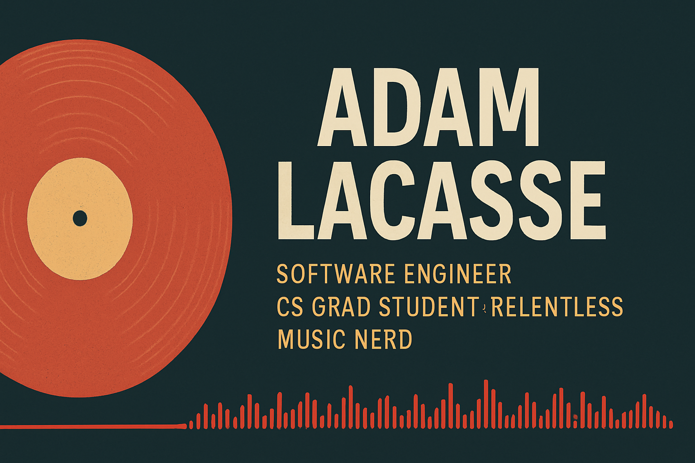

  

# 👋 Hi, I'm Adam LaCasse

**Senior Software Engineer · CS Grad Student · Relentless Music Nerd**

🌐 **Portfolio & writing:** https://adamlacasse.dev

I build enterprise-scale web applications and cloud-native services with a focus on **clarity, correctness, and long-term maintainability**. My professional work spans Node.js, React, Java/Spring Boot, Python, and AWS — often in environments where systems must scale to thousands of users and evolve safely over time.

I’m also working toward a **Master of Science in Computer Science**, strengthening the theoretical foundations that support good engineering: algorithms, discrete math, data modeling, and systems thinking. I care deeply about understanding *why* things work — not just making them work.

Outside of software, I’m a lifelong music obsessive — the kind of person who can happily debate Jack DeJohnette’s fusion era or the production choices on Talking Heads’ _Little Creatures_. I enjoy exploring the overlap between **music, data, and technology**, and building tools for people who share that curiosity.

---

## 🚀 What I Work With

**Languages**  
JavaScript (ES6+) · TypeScript · Python · Java · SQL

**Frameworks & Tools**  
Node.js · React · Spring Boot · Express · Flask  
PostgreSQL · MySQL · MongoDB  
AWS Lambda · S3 · API Gateway  
Docker · Git · CI/CD · Vercel

**Interests**  
Backend systems · Databases · Distributed systems  
Algorithms · Data modeling  
Music technology · Data-driven music discovery

---

## 🎧 Projects & Experiments

### 🎪 **Freq Show**
A music-nerd application designed to explore artist, album, and track metadata — built for people who read liner notes for fun.

- Focused on rich metadata, search, and discovery
- Designed with extensibility in mind for future data sources
- A creative outlet that blends engineering with deep musical curiosity

---

### 🌱 **NorthFlow**
A mindfulness and gratitude check-in application built as part of my CS coursework, with an emphasis on **backend design and data integrity**.

- Designed a normalized MySQL schema (3NF) with composite primary keys and foreign-key constraints
- Implemented a clean data access layer (DAL) with consistent error handling
- Wrote aggregate queries and stored procedures to summarize meaningful user data
- Intentionally scoped the UI to keep the focus on database design and system structure

NorthFlow reflects how I approach systems: deliberate tradeoffs, clear boundaries, and room to grow.

---

### 🧰 **Engineering Utilities & Learning Projects**
A collection of smaller projects and experiments, including:

- Database design exercises and schema evolution
- SQL queries, views, and procedures
- Algorithmic problem solving and analysis
- Scripting tools and coursework supporting my CS master’s program

These projects emphasize fundamentals, correctness, and learning through building.

---

## 📚 Current Focus

- Progressing through my **CS master’s curriculum**
- Strengthening fundamentals in **algorithms, discrete math, and data modeling**
- Designing reliable, scalable, API-driven backend systems
- Exploring the intersection of **music, data, and software**
- Building side projects that balance engineering rigor with creative curiosity

I’m especially interested in work involving **backend systems, databases, and thoughtful product engineering**.

---

## 🔗 Find Me Elsewhere

### **ORCID**

### **LinkedIn**
https://linkedin.com/in/adamlacasse

### **Portfolio**
https://adamlacasse.dev
